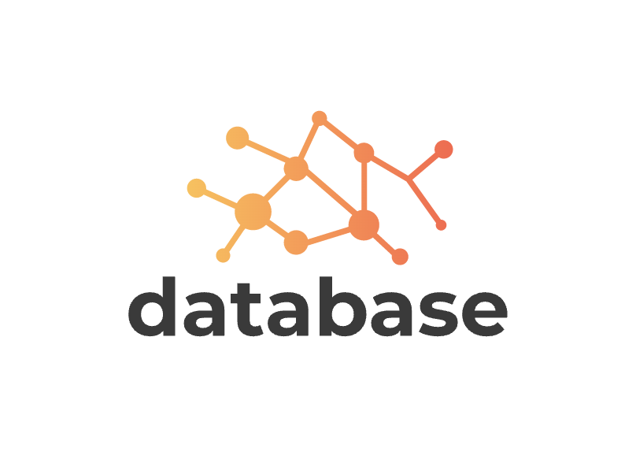

<br>

 

A fast, scalable in-memory for key-value database that support multiple features:

- Zero dependency
- 100% test coverage
- Security guaranteed
- Has simple synchronous API
- Supported namespace for your database

# Install

```bash
# using npm
npm install --save @drstrain/database

# using yarn
yarn add @drstrain/database
```

# Example usage

Create a new Database instance.

```javascript
const Database = require('@drstrain/database');
const db = new Database();
```

Create a new Database instance with namespace supported. Database will be stored as `${name_space}_${key}`-value

```javascript
const Database = require('@drstrain/database');
const db = new Database('session');
```

Storing data to key.

```javascript
const data = {
  username: 'drstrain',
  secret: {
    notes: [],
    key: 'somesecret',
  }
}
db.set('key', data);
```

Querying data from key string.

```javascript
const val = db.get('key');
console.log(val);
```

Clear database

```javascript
const val = db.clear();
console.log(val);
```

# License

Licensed under <a href="/LICENSE">MIT</a>

# Thank you

By using this product, thank you for your support!